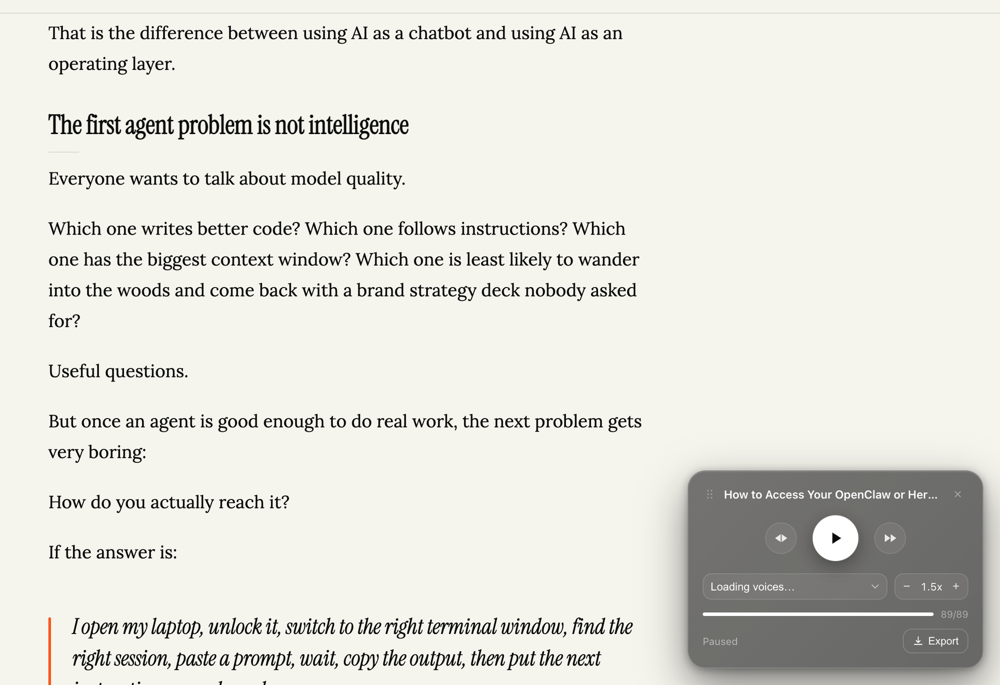

# Read Aloud  On-Device Text-to-Speech 

**Free, private, offline text-to-speech for webpages and PDFs.** Read Aloud turns any
article or PDF into natural-sounding narration entirely on your device no server,
no account, no API key, nothing ever leaves your browser.

Built on [Kokoro-82M](https://huggingface.co/hexgrad/Kokoro-82M), a small
open-weight neural TTS model that runs locally via ONNX/WASM, so every word is
synthesized on your own machine.



[](LICENSE)
[](extension/manifest.json)
[](#privacy)
[](#privacy)

**[Download the extension](https://github.com/AI-ate-my-homework/read-aloud/archive/refs/heads/main.zip)** — no build step, no Chrome Web Store account needed. See [Install](#install-3-steps-no-build-required) for the 3-step setup.

## Contents

- [Why](#why)
- [Features](#features)
- [Install (3 steps, no build required)](#install-3-steps-no-build-required)
- [Usage](#usage)
- [Privacy](#privacy)
- [How it works](#how-it-works)
- [Building from source](#building-from-source)
- [Known limitations](#known-limitations)
- [Contributing](#contributing)
- [License](#license)

## Why

Most "read aloud" and text-to-speech Chrome extensions either route your page
content through a cloud API, require a login, or gate real voices behind a
subscription. Read Aloud does none of that — it's a free, open-source, on-device
text-to-speech reader with no account, no server calls, and no recurring cost.
It's the extension to reach for when you want to listen to long articles, blog
posts, documentation, or PDFs without leaving the tab, and without your reading
material going anywhere but your own machine.

## Features

- **Reads any article or PDF aloud** — one click extracts the readable content
  (via [Mozilla Readability](https://github.com/mozilla/readability)) and starts
  narrating immediately.
- **Natural, on-device neural voices** — powered by Kokoro-82M, no cloud TTS API.
- **Gapless streaming playback** — sentences are synthesized and scheduled
  back-to-back on the Web Audio timeline as they're generated, so there's no
  waiting for the whole page to render before playback starts.
- **Playback controls** — play/pause, skip sentence forward/back, voice picker,
  and adjustable speed (0.75x–2x).
- **Read from any selection** — highlight text on the page and jump straight to
  reading from there, via the right-click context menu ("Read from here") or a
  keyboard shortcut (`Ctrl+Shift+Y` / `⌘+Shift+Y`).
- **Export to MP3** — once a page has finished synthesizing, download the whole
  narration as an MP3 file.
- **PDF support** — opens `.pdf` URLs in a bundled pdf.js viewer and reads the
  extracted text.
- **Minimal, glass-styled floating player** — a small, draggable, black-and-white
  UI that stays out of the way of the page you're reading.

## Install (3 steps, no build required)

Not on the Chrome Web Store yet — the extension is already built and ready to
load straight from this repo:

1. **Download** — click the green **Code** button above and choose
   **Download ZIP** (or `git clone` this repo), then unzip it.
2. **Load it** — open `chrome://extensions` in Chrome, turn on **Developer
   mode** (top right), click **Load unpacked**, and select the `extension`
   folder from the unzipped download.
3. **Use it** — open any article or PDF and click the Read Aloud icon in your
   toolbar. It starts reading immediately.

Prefer to build from source instead (e.g. to modify the code)? See
[Building from source](#building-from-source) below.

## Usage

- **Start/stop reading**: click the extension's toolbar icon on any article page.
  A floating player appears and starts reading; click the icon again (or the
  player's close button) to stop.
- **PDF**: open any URL ending in `.pdf` — it's redirected into the bundled pdf.js
  viewer automatically and read aloud the same way.
- **Read from a selection**: select text on the page, then either right-click and
  choose **Read from here**, or press `Ctrl+Shift+Y` (`⌘+Shift+Y` on macOS).
- **Controls**: skip sentence back/forward, change voice, change speed
  (0.75x–2x), and export the narration as an MP3 once synthesis has caught up
  to the end of the page.

First run downloads the Kokoro model (~86MB), cached afterward — expect
"Loading voice model…" to sit for a bit the very first time you use it.

## Privacy

- No account, no sign-in, no server.
- Text-to-speech runs entirely on-device via an offscreen document running the
  Kokoro ONNX/WASM model — nothing you read or listen to is ever uploaded anywhere.
- The only network activity is the one-time model download (cached locally) and
  fetching a PDF you opened yourself.

## How it works

```
src/
  background.js       service worker — routes messages, owns the offscreen
                       document, installs the PDF -> viewer redirect rule,
                       and wires the context menu / keyboard shortcut
  offscreen.js         loads Kokoro (kokoro-js) and runs generate() per sentence
  content.js           injected on toolbar click — Readability extraction
  pdf-viewer.js        bundled pdf.js viewer — fetch + render + text extraction
  reader-session.js    shared glue: floating player <-> audio engine <-> messaging
  audio-engine.js       Web Audio scheduling for gapless chunk playback
  player-ui.js           floating player UI (shadow DOM, glassmorphism styling)
  mp3-encoder.js          lamejs wrapper for the Export MP3 button
extension/            build output — this is what you load unpacked
build.mjs             esbuild bundling + static asset copy
```

Text extraction, sentence splitting, and speech synthesis all happen in the
browser tab or an offscreen document belonging to the extension — never on a
remote server.

## Building from source

Only needed if you want to modify the code — the `extension/` folder in this
repo is already built and ready to load as-is (see [Install](#install-3-steps-no-build-required)).

```bash
git clone https://github.com/AI-ate-my-homework/read-aloud.git
cd read-aloud
npm install
npm run build
```

This regenerates the `extension/` folder from `src/`. Reload the extension at
`chrome://extensions` (the reload icon on its card) to pick up changes.

## Known limitations

- PDF interception only matches URLs ending in `.pdf`; PDFs served without that
  extension, or via embedded viewers, aren't covered yet.
- MP3 export runs synchronously on the page's main thread — fine for typical
  articles, but a very long document could visibly stall the tab while encoding.
- Sentence splitting is a simple regex and can mishandle some abbreviations
  (e.g. "Mr.").
- No Firefox or Edge build yet (Chrome MV3 only).

## Contributing

Issues and pull requests are welcome. If you're adding a feature, please keep
changes scoped to `src/` and rebuild with `npm run build` before submitting.

## License

[MIT](LICENSE)
